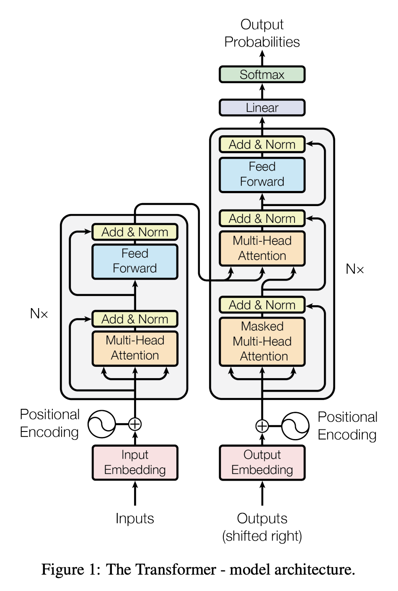
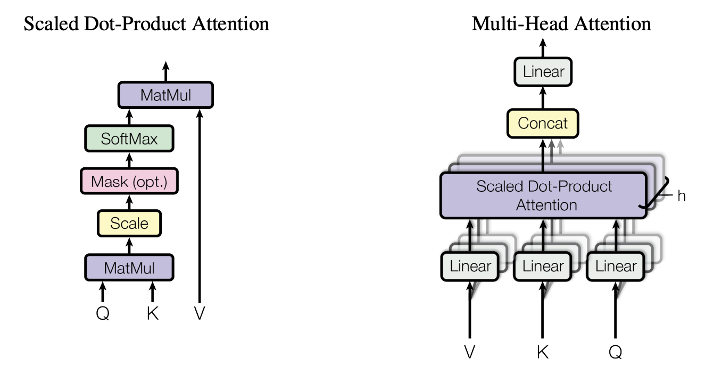
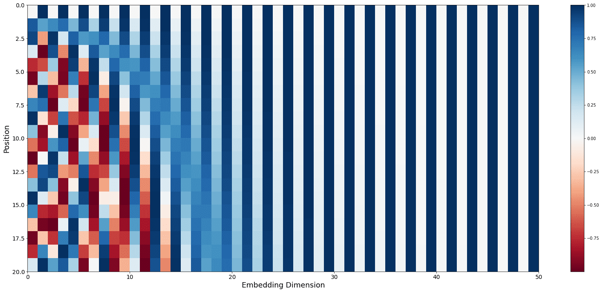
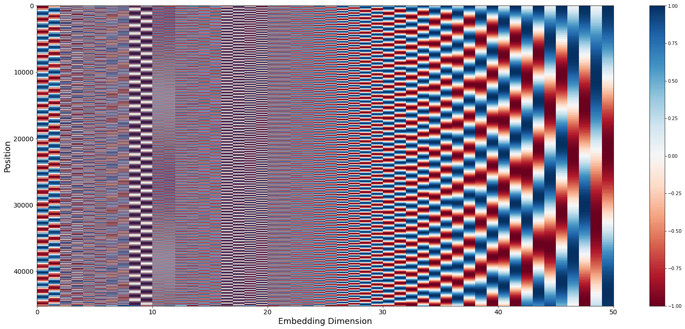
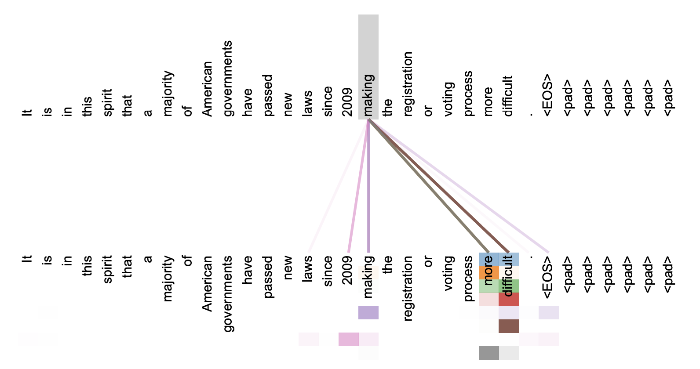

# 理解《Attention Is All You Need》

:::tip 摘要
[Attention Is All You Need](https://arxiv.org/pdf/1706.03762)
:::

## 摘要和概念解析
> The dominant sequence transduction models are based on complex recurrent or
convolutional neural networks that include an encoder and a decoder. The best
performing models also connect the encoder and decoder through an attention
mechanism. We propose a new simple network architecture, the Transformer,
based solely on attention mechanisms, dispensing with recurrence and convolutions
entirely.

在论文提出时，在翻译领域已经有很多序列模型存在了, 例如[Seq2Seq](./seq2seq.md)。`sequence transduction` 在这里指的是序列转换任务，也就是把一个输入序列（例如英语）转换成另一个输出序列（例如中文）的任务。机器翻译、语音识别都算此类任务。这些模型基本上都包含encoder和decoder。同时[注意力机制](./attention.md)也已经被一些模型使用了。本文提出的Transformer模型仅基于注意力机制，不使用循环和卷积。

## 背景

> Recurrent models typically factor computation along the symbol positions of the input and output
sequences. 
 
...
 
This inherently
sequential nature precludes parallelization within training examples, which becomes critical at longer
sequence lengths, as memory constraints limit batching across examples. 

现在很多循环神经网络模型的计算都是基于输入和输出序列的符号位置。这样的问题是使并行计算很受限，因为必须先计算前一个位置，然后才能才能计算后一个位置。对于长序列来说，在内存有限制时，同一批次样本数量还会更少，限制更甚。

> ...
 
all of which use convolutional neural networks as basic building
block, computing hidden representations in parallel for all input and output positions.
 
...
 
In the Transformer this is
reduced to a constant number of operations, albeit at the cost of reduced effective resolution due
to averaging attention-weighted positions, an effect we counteract with Multi-Head Attention as
described in section 3.2.

卷积神经网络是一种解决顺序性的手段，可以并行计算所有输入输出位置的隐含表示，但是问题是计算量会随任意输入输出的距离而增长。例如ConvS2S是线性增长，ByteNet是指数增长。这对处理长文本很不友好，因为卷积无法学到卷积核范围外的关系。但是卷积核的好处是每种卷积核可以独立运行，并行计算，输出多种特征。
 
Transformer通过注意力机制做到了距离无关，提升了效率，但是有效分辨率被降低。作者参考了卷积神经网络里的多通道设计，发明了多头注意力机制，让不同的注意力可以学习不同特征，改善了分辨率问题。

## 核心思想
### 模型架构

> **Encoder**: The encoder is composed of a stack of N = 6 identical layers. Each layer has two
sub-layers. The first is a multi-head self-attention mechanism, and the second is a simple, positionwise fully connected feed-forward network. We employ a residual connection around each of
the two sub-layers, followed by layer normalization. That is, the output of each sub-layer is
LayerNorm(x + Sublayer(x)), where Sublayer(x) is the function implemented by the sub-layer
itself. To facilitate these residual connections, all sub-layers in the model, as well as the embedding
layers, produce outputs of dimension $d_{model} = 512$.
 
**Decoder**: The decoder is also composed of a stack of N = 6 identical layers. In addition to the two
sub-layers in each encoder layer, the decoder inserts a third sub-layer, which performs multi-head
attention over the output of the encoder stack. Similar to the encoder, we employ residual connections
around each of the sub-layers, followed by layer normalization. We also modify the self-attention
sub-layer in the decoder stack to prevent positions from attending to subsequent positions. This
masking, combined with fact that the output embeddings are offset by one position, ensures that the
predictions for position i can depend only on the known outputs at positions less than i.

{width=300 .img-center}

Encoder里有6层完全一样的构造组成，每一层又有2个子层。第一层是多头注意力，第二层是简单的全连接前馈神经网络。为了防止梯度消失，还引入了残差连接。
 
有几个点要注意，首先是`positionwise fully connected feed-forward network`，这里的`positionwise`可以理解为对每个token独立计算，token中已经包含了位置信息，因此FNN就不再为了进一步提取信息，而是做非线性变换，不做多token的信息混合。transformer里每一层都带个FNN，设计思想和神经网络激活层是差不多的，本质上是为了提供非线性变换，打破单纯的加权平均，提高表达能力。如果是仅堆叠多层多头注意力，就容易发生信息密度下降和表达能力退化，丢失细节和特征多样性。
 
残差连接让每一层多头注意力都能利用学习原文和前一层的特征，使表达能力丰富且逐层深入。此外保证神经网络不会发生退化，即使无法学到新内容，也只会退化到恒等映射。
 
Decoder里多了一个子层，这个子层接收了Encoder的输出，此外自注意力层做了位置掩码，让每个位置只能看到自己之前的。这样保证了训练时和预测时行为的一致。

### 注意力机制

> An attention function can be described as mapping a query and a set of key-value pairs to an output,
where the query, keys, values, and output are all vectors. The output is computed as a weighted sum of the values, where the weight assigned to each value is computed by a compatibility function of the
query with the corresponding key.

注意力函数可以看成 $\mathbf{ output }= f(\mathbf{Q},\mathbf{K},\mathbf{V})$，output、QKV都是向量。output是V的加权求和，权重由Q和K的相似度函数计算得到。
{width=400 .img-center}

> We call our particular attention "Scaled Dot-Product Attention" (Figure 2). The input consists of
queries and keys of dimension $d_k$, and values of dimension $d_v$. We compute the dot products of the
query with all keys, divide each by $\sqrt{d_k}$, and apply a softmax function to obtain the weights on the
values.

在Transformer的注意力机制里，核心是计算Q和K的点积。这里本质上是求QK的距离，或者说是相似度。对于两个向量来说，点击运算是求Q到K上投影的长度，越长代表越接近。需要注意，两个向量是有可能点积后为负数的，softmax在这里解决了这个问题。softmax把一组分数转换成概率分布，使所有概率大于0并且加起来等于一。

$$对于[x_1, x_2, ..., x_n], Softmax(x_i) = \frac{e^{x_i}}{\sum_{j=1}^{n}e^{x_j}}$$
> In practice, we compute the attention function on a set of queries simultaneously, packed together
into a matrix Q. The keys and values are also packed together into matrices K and V . We compute
the matrix of outputs as:
$$Attention(Q, K, V ) = softmax(\frac{QK^T}{\sqrt{d_k}})V $$

在实践中，为了方便并行计算（矩阵计算），QKV都被打包成矩阵，向量q和向量k的点积，可以看成$\mathbf{q}\cdot\mathbf{k}^T$，那对于矩阵，q每一行分别点乘k的每一列，得到一个行向量，这个行向量就是q对每一个k的注意力。那$QK^T$就是所有q对所有k的注意力。这里的$\sqrt{d_k}$解决了向量点积后数值过大的问题，这个缩放因子来源于概率统计中的方差归一化[^dk]。

> The two most commonly used attention functions are additive attention, and dot-product (multiplicative) attention. 
 
...
 
dot-product attention is much faster and more space-efficient in practice, since it can be implemented using highly optimized
matrix multiplication code.

作者比较了additive attention和dot-product attention，发现后者适用矩阵运算优化，计算速度更快。

>  We suspect that for large values of $d_k$, the dot products grow large in magnitude, pushing the softmax function into regions where it has extremely small gradients. To counteract this effect, we scale the dot products by $\frac{1}{\sqrt{d_k}}$

作者解释了$d_k$增大时，点积的值域会变大，会让softmax梯度变小，因此需要缩放因子。

### 多头注意力

> Instead of performing a single attention function with $d_{model}$-dimensional keys, values and queries,
we found it beneficial to linearly project the queries, keys and values $h$ times with different, learned
linear projections to $d_k$, $d_k$ and $d_v$ dimensions, respectively. On each of these projected versions of
queries, keys and values we then perform the attention function in parallel, yielding $d_v$-dimensional output values. These are concatenated and linearly transformed to produce the final values.

作者发现把qkv做h个不同参数的线性变换，然后分别并行的计算注意力，最后再拼接起来，效果会更好。

> Multi-head attention allows the model to jointly attend to information from different representation
subspaces at different positions. With a single attention head, averaging inhibits this.
$$MultiHead(Q, K, V ) = Concat(head_1, ..., head_h)W^O$$
where
$$head_i = Attention(QW_i^Q, KW_i^K, VW_i^V )$$

这里面每个W都是待学习的参数矩阵。$W_i^Q \in R^{d_{model} \times d_k}$，指的是将原始的Q投影到第i个头的查询空间；
$W_i^K \in R^{d_{model} \times d_k}$，指的是将原始的K投影到第i个头的键空间；
$W_i^V \in R^{d_{model} \times d_v}$，指的是将原始的V投影到第i个头的值空间；
$W^O \in R^{hd_v \times d_{model}}$，指的是将所有头的输出拼接起来，再投影到原始的输出空间。

#### 注意力机制的应用

> In "encoder-decoder attention" layers, the queries come from the previous decoder layer,
and the memory keys and values come from the output of the encoder. This allows every
position in the decoder to attend over all positions in the input sequence. 

作者解释query来自decoder上一层，key和value来自encoder，这样decoder的每一个位置都可以关注输入序列(encoder输出)的每一个位置。

> The encoder contains self-attention layers. In a self-attention layer all of the keys, values
and queries come from the same place, in this case, the output of the previous layer in the
encoder. Each position in the encoder can attend to all positions in the previous layer of the
encoder.

作者解释encoder的自注意力层里，qkv都来自上一层的输出，这样encoder的每一个位置都可以关注上一层的每一个位置。

> Similarly, self-attention layers in the decoder allow each position in the decoder to attend to
all positions in the decoder up to and including that position. We need to prevent leftward
information flow in the decoder to preserve the auto-regressive property. We implement this
inside of scaled dot-product attention by masking out (setting to −∞) all values in the input
of the softmax which correspond to illegal connections.

作者解释decoder的每一个位置都可以关注这个位置和之前的位置。为了保证自回归性，也就是防止一个位置看到未来(右侧)，需要在softmax之前把非法连接的位置mask掉，即设置为$-\infty$。如果能看到右侧会导致训练的结果和预测的结果不一致，使预测失去因果性。之所以选择负无穷，是因为softmax(-$\infty$)=0。

### FFN

> In addition to attention sub-layers, each of the layers in our encoder and decoder contains a fully
connected feed-forward network, which is applied to each position separately and identically. This
consists of two linear transformations with a ReLU activation in between.
$$FFN(x) = max(0, xW_1 + b_1)W_2 + b_2$$

transformer里的FFN层包含两层线性变换，第一层用了ReLU激活函数,保证FFN的非线性。
### 位置编码

> Since our model contains no recurrence and no convolution, in order for the model to make use of the
order of the sequence, we must inject some information about the relative or absolute position of the
tokens in the sequence. To this end, we add "positional encodings" to the input embeddings at the
bottoms of the encoder and decoder stacks. The positional encodings have the same dimension $d_{model}$
as the embeddings, so that the two can be summed.

作者解释模型结构不像循环神经网络那样能提供位置信息，只能自己把位置信息编码到序列token里。

$$PE_{(pos,2i)} = sin(pos/10000^{2i/d_{model}})$$
$$PE_{(pos,2i+1)} = cos(pos/10000^{2i/d_{model}})$$

>where pos is the position and i is the dimension. That is, each dimension of the positional encoding
corresponds to a sinusoid. The wavelengths form a geometric progression from 2π to 10000 · 2π. We
chose this function because we hypothesized it would allow the model to easily learn to attend by
relative positions, since for any fixed offset k, $PE_{pos+k}$ can be represented as a linear function of
$PE_{pos}$.

这里解释作者用正弦波做位置编码。作者假设正弦波能让模型容易学习相对位置的注意力，因为对于任意的偏移k，$PE_{pos+k}$可以看成$PE_{pos}$的一个线性函数。
这里有一点，就是为什么说线性函数能让模型容易学习相对位置的注意力，原因是因为，如果用onehot或者单调递增的数值做位置编码，就很难通过线性变换得到两个位置的距离，但是对于正余弦来说，使用点积等线性操作就可以反映出距离。pos保证了不同位置的频率不同，低维的编码变化快（短周期），高维的编码变化慢（长周期），这样能覆盖不同粒度的位置信息。2i保证了不同维度的相位不同。
 
这里有一个有趣的点是模型为什么能理解加和的位置信息。一种说法是神经网络的反向传播和梯度下降，自动最大化利用信息的方向，比如当前朝token信息方向已经无法降低loss，那么它就会往位置信息去走，但是神经网络本身是黑盒，并不能解释谁发现和用好了位置信息。

[understanding-positional-encoding-in-transformers](https://erdem.pl/2021/05/understanding-positional-encoding-in-transformers)

低维的编码变化快（短周期），高维的编码变化慢（长周期）。

高维分量能唯一标识很长序列中的位置，低维分量则能区分相邻或局部位置。

## 自注意力
> In this section we compare various aspects of self-attention layers to the recurrent and convolutional layers
 
...
 
One is the total computational complexity per layer. Another is the amount of computation that can
be parallelized, as measured by the minimum number of sequential operations required.
 
The third is the path length between long-range dependencies in the network. 

作者比较了自注意力层、循环层和卷积层，主要考虑到的维度是计算复杂度、并行化能力和路径长度。上文看到通过点积注意力计算，模型可以同时处理所有词的注意力，而在CNN等网络中感受野有限，需要多层叠加,无法并行；而对于路径来说，自注意力中，任意两个词的“信息传递路径”只有1步（直接关注），而RNN需要n步（逐词传递），CNN需要$log_kn$步（多层卷积叠加），k是卷积核的大小，因此自注意力的路径长度最短。

## 注意力可视化
{width=500 .img-center}
图片描述了不同注意力头关注了不同的词汇，说明一些注意力头确实关注了语法或语义的依赖关系。

正文结束

## 附录
[^dk]: **$\sqrt{d_k}$ 缩放因子的推导**  
假设 $q$ 和 $k$ 是长度为 $d_k$ 的向量，每一维都是均值为 $0$、方差为 $1$ 的独立随机变量。  
点积 $q \cdot k = \sum_{i=1}^{d_k} q_i k_i$，其方差为 $d_k$。  
除以 $\sqrt{d_k}$ 后，方差归一化为 $1$，保证 softmax 输入分布稳定。  